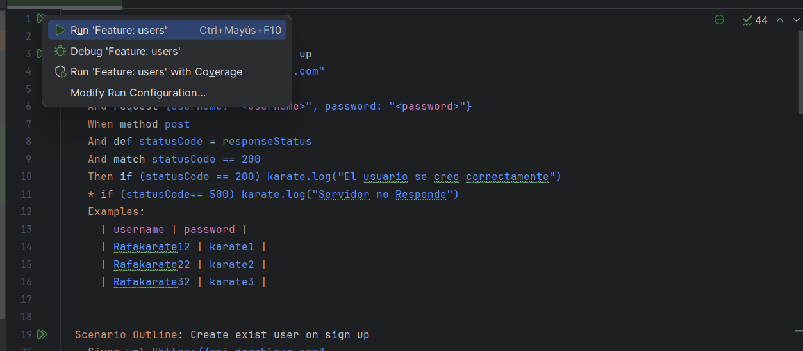
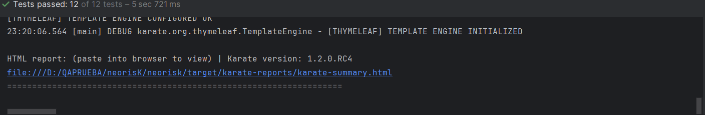

# Test Karate Neoris

Resolución de test de Karate para Neoris.
• Crear un nuevo usuario en signup
• Intentar crear un usuario ya existente
• Usuario y password correcto en login
• Usuario y password incorrecto en login

## Ejecución del feture `users.feature`:

Click derecho en el archivo `users.feature` y seleccionar la opción `Run 'users.feature'`

## Resultado de la ejecución:
Se genera un reporte en formato HTML en la carpeta `target/surefire-reports` con el nombre `karate-reports`, cada vez que se ejecuta el archivo `users.feature` se genera un nuevo reporte.
Al finalizar la ejecución se muestra un mensaje en la consola con el resultado de la ejecución y al final la ruta del reporte. 

